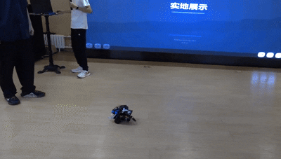

# Robotics-from-Scratch

一个基于 Raspberry Pi 和 Arduino UNO 的视觉跟随机器人小车项目。

系统使用 Raspberry Pi 负责视觉感知、云台控制和跟随决策；Arduino UNO 负责底盘电机控制、编码器读取和控制模式切换。项目同时保留一套基于 ESP-NOW 的手动遥控链路，用于在自动跟随和人工遥控之间切换。

当前项目已完成视觉检测、云台控制、串口通信、底盘闭环控制和基础自动跟随联调，仍在继续优化延迟、目标丢失恢复和控制稳定性。

## Demo

### 云台/视觉跟踪


### 小车跟随



## 系统架构

主控制链路：

```text
Camera
  ↓
Raspberry Pi
  ├── vision: MediaPipe pose/face detection
  ├── planning: gimbal + follow control
  ├── hardware/gimbal.py: GPIO PWM gimbal control
  └── hardware/serial_comm.py: UART JSON command
          ↓ USB/UART
Arduino UNO
  ├── mode manager
  ├── encoder reading
  ├── incremental PI motor control
  └── TB6612FNG motor driver
          ↓
Two-wheel differential chassis
```

遥控链路：

```text
ESP32-S3 remote controller
  ↓ ESP-NOW
ESP32-C3 car receiver
  ↓ UART
Arduino UNO
  ↓
Chassis
```

设计边界：

- Raspberry Pi 不直接控制底盘电机。
- Arduino UNO 不处理视觉和高层决策。
- 云台舵机由 Raspberry Pi GPIO 直接控制。
- 底盘运动指令通过 UART JSON 从 Raspberry Pi 发送到 Arduino。
- 遥控器链路独立于视觉模块，可切换手动/自动模式。

## 当前功能

- 姿态检测：使用 MediaPipe Pose 提取人体目标位置、尺寸和置信度。
- 人脸检测：保留 Face Landmarker 测试模块，用于单独验证视觉链路。
- 云台跟踪：根据目标偏移量输出 pan/tilt 舵机绝对角。
- 自动跟随：根据目标高度控制前进/后退，根据云台水平角控制底盘转向。
- 底盘控制：Arduino UNO 基于编码器反馈做增量式 PI 控制。
- 手动遥控：ESP32-S3 通过 ESP-NOW 向 ESP32-C3 发送摇杆控制数据。
- 模式切换：支持遥控模式、树莓派自动模式、串口调试模式和演示模式。
- 安全停车：遥控超时、树莓派指令超时、程序退出时均会停车。

## 项目结构

```text
Robotics-from-Scratch/
├── README.md
├── doc/
├── raspberry_pi/
│   ├── main.py
│   ├── vision/
│   │   ├── pose_landmarker.py
│   │   ├── face_landmarker.py
│   │   ├── hand_landmarker.py
│   │   ├── pose_landmarker.task
│   │   ├── face_landmarker.task
│   │   └── hand_landmarker.task
│   ├── planning/
│   │   ├── config.py
│   │   ├── planner.py
│   │   ├── gimbal_controller.py
│   │   ├── follow_controller.py
│   │   ├── types.py
│   │   └── __init__.py
│   ├── hardware/
│   │   ├── gimbal.py
│   │   ├── serial_comm.py
│   │   └── __init__.py
│   └── tools/
│       ├── face_follow_test.py
│       ├── face_gimbal_test.py
│       ├── manual_gimbal.py
│       └── __init__.py
└── arduino/
    ├── Arduino_TB6612_TwoWheel_Car.ino
    ├── remote_controller/
    │   └── remote_controller.ino
    ├── car_receiver/
    │   └── car_receiver.ino
    ├── docs/
    ├── logs/
    ├── MG513XP28_12V_接线指南.md
    └── 遥控器系统接线指南.md
```

## Raspberry Pi 端

主入口：

```bash
python -m raspberry_pi.main --port /dev/ttyACM0
```

常用调试参数：

```bash
python -m raspberry_pi.main \
  --port /dev/ttyACM0 \
  --camera-id 0 \
  --frame-width 640 \
  --frame-height 480 \
  --camera-fps 15 \
  --control-hz 10 \
  --debug-vision \
  --debug-control \
  --debug-gimbal
```

主流程：

1. 打开串口连接 Arduino。
2. 发送 `p`，让 Arduino 进入树莓派自动模式。
3. 启动控制线程，按固定频率运行 `Planner`。
4. 通过 `rpicam-vid` 获取摄像头 MJPEG 视频流。
5. 使用 MediaPipe Pose 检测人体目标。
6. 将视觉结果转换为 `VisionTarget`。
7. 计算云台角度和底盘运动指令。
8. 通过 GPIO 控制云台，通过 UART 控制底盘。
9. 程序退出时发送停车指令，并切回遥控模式。

主要模块：

- `raspberry_pi/main.py`：自动跟随主流程。
- `vision/pose_landmarker.py`：主流程使用的姿态检测模块。
- `vision/face_landmarker.py`：人脸检测测试模块。
- `planning/planner.py`：整合目标丢失处理、云台控制和跟随控制。
- `planning/gimbal_controller.py`：根据目标偏移输出云台绝对角。
- `planning/follow_controller.py`：根据目标高度和云台水平角输出底盘速度。
- `hardware/gimbal.py`：通过 pigpio 控制舵机 PWM。
- `hardware/serial_comm.py`：负责串口 JSON 通信和日志。

## 视觉输出

视觉模块输出归一化目标信息：

```python
{
    "target_x": 320,
    "target_y": 240,
    "height": 180,
    "width": 90,
    "target_x_norm": 0.50,
    "target_y_norm": 0.50,
    "x_error_norm": 0.00,
    "y_error_norm": 0.00,
    "height_norm": 0.375,
    "width_norm": 0.141,
    "confidence": 0.86,
}
```

主流程会转换为：

```python
VisionTarget(
    x_error_norm=...,
    y_error_norm=...,
    height_norm=...,
    width_norm=...,
    confidence=...,
)
```

## 云台控制

云台由 Raspberry Pi GPIO 直接控制，默认引脚：

- `pan_pin = 17`
- `tilt_pin = 27`

云台控制输出：

```python
GimbalOutput(
    pan_delta=...,
    tilt_delta=...,
    pan_abs=...,
    tilt_abs=...,
)
```

字段说明：

- `pan_abs`：水平舵机绝对角。
- `tilt_abs`：俯仰舵机绝对角。
- `pan_delta`：本轮水平角度变化量，仅用于调试。
- `tilt_delta`：本轮俯仰角度变化量，仅用于调试。

使用云台前需要启动 pigpio：

```bash
sudo pigpiod
```

## Arduino 端

底盘主控代码：

```text
arduino/Arduino_TB6612_TwoWheel_Car.ino
```

硬件配置：

- 主控：Arduino UNO
- 电机驱动：TB6612FNG
- 电机：MG513XP28 12V 霍尔编码器减速电机
- 底盘：两驱差速底盘，前部万向轮
- 供电：12V 锂电池组
- 控制周期：5 ms

Arduino 支持四种模式：

- `CTRL_MODE_DEMO`：演示模式
- `CTRL_MODE_SERIAL`：串口手动调试模式
- `CTRL_MODE_REMOTE`：ESP-NOW 遥控模式
- `CTRL_MODE_RPI_AUTO`：树莓派视觉跟随模式

## Raspberry Pi 与 Arduino 通信

### 进入自动模式

Raspberry Pi 启动后先发送：

```text
p
```

Arduino 收到后切换到 `CTRL_MODE_RPI_AUTO`。

### 运动控制

```json
{"cmd":"move","v":0.3,"w":-0.2}
```

字段说明：

- `v`：线速度指令，范围约为 `[-1.0, 1.0]`。
- `w`：角速度指令，范围约为 `[-1.0, 1.0]`。
- Arduino 将 `v/w` 映射为左右轮目标脉冲速度。

### 状态查询

```json
{"cmd":"status"}
```

返回示例：

```json
{
  "status": "ok",
  "mode": "rpi_auto",
  "flagStop": false,
  "rpiAuto": true,
  "velocity": 12.0,
  "turn": -3.0,
  "targetA": 9,
  "targetB": 15,
  "pwmA": 120,
  "pwmB": 135,
  "encA": 8,
  "encB": 14,
  "battery": 12.1
}
```

### 模式切换

```json
{"cmd":"mode","mode":"rpi_auto"}
```

```json
{"cmd":"mode","mode":"remote"}
```

## 遥控链路

遥控器代码：

```text
arduino/remote_controller/remote_controller.ino
```

小车端接收器代码：

```text
arduino/car_receiver/car_receiver.ino
```

遥控器端：

- 硬件：ESP32-S3
- 输入：摇杆控制前进/后退/左右转向
- 按键：切换手动/自动模式
- 通信：ESP-NOW
- 数据：`velocity`、`turn`、`flags`、`checksum`

小车接收端：

- 硬件：ESP32-C3
- 接收：ESP-NOW 控制包
- 转发：通过 UART1 发送给 Arduino UNO
- 回传：读取 Arduino 编码器反馈并回传给遥控器

ESP32-C3 到 Arduino 的 UART 协议：

```text
$V<vel>,T<turn>,F<flags>*
```

示例：

```text
$V50,T0,F0*
```

## 辅助工具

```bash
python -m raspberry_pi.tools.manual_gimbal
python -m raspberry_pi.tools.face_gimbal_test
python -m raspberry_pi.tools.face_follow_test
```

用途：

- `manual_gimbal.py`：手动测试云台角度。
- `face_gimbal_test.py`：测试人脸检测和云台联动。
- `face_follow_test.py`：测试视觉跟随相关逻辑。

## 当前状态

已完成：

- MediaPipe Pose 视觉检测接入
- rpicam MJPEG 视频流读取
- 树莓派 GPIO 云台控制
- 云台跟踪控制器
- 底盘跟随控制器
- Raspberry Pi 与 Arduino JSON 串口通信
- Arduino 编码器读取和增量式 PI 控制
- ESP-NOW 遥控链路
- 自动/遥控模式切换
- 基础联调 demo

仍需优化：

- 降低视觉链路延迟
- 提高目标丢失后的恢复能力
- 优化云台和底盘控制耦合
- 调整底盘速度和转向参数
- 整理硬件接线、供电和调参文档
